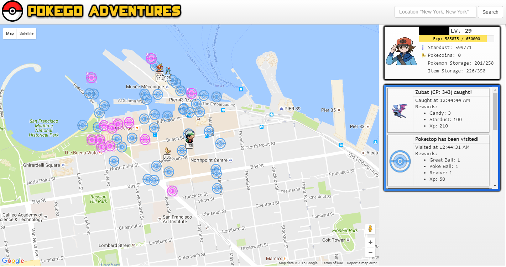

# PokeGo Adventures Pokemon Go Bot
A free Pokemon Go bot with local website, live map, and notifications. See your player move around in real time and catch pokemon!  
Status: **Defunct**  
[Latest Release Download](https://github.com/cqian19/Pokemon-Go-Adventures-Bot/releases/latest)

## Features
* Easy to use web interface
* Live map that shows your trainer moving around and pokemon being caught in real time!
* Live web notifications when catching pokemon and spinning pokestops along with rewards!
* Location spoofing. Set your location anywhere in the world!
* Displays trainer info (Level, Exp, Stardust, etc.)
* Login from the website. Supports PTC and Google. No ugly command-line logins.
* Automatically walks to pokemon and catches them
* Automatically spins pokestops
* Automatically releases and evolves pokemon
* Discards unnecessary items when bag is near full
* Picks best pokeball to use
* Search bar feature for changing locations
* Configure walkspeed, search radius, and more!
* Free to use!

## Getting Started
This bot requires Python 3. Using versions of Python 2 will not work. If you already have Python 3 and pip configured, skip to step 4.  
1. Fork/Download this project as a zip and extract.  
2. Install Python 3 here. https://www.python.org/downloads/release/python-344/  
3. Follow [(this guide here)](https://github.com/AHAAAAAAA/PokemonGo-Map/wiki/Windows-Installation-and-requirements) to get python and pip running on the command-line (Remember to use Python 3 instead of Python 2).  
4. Follow the instructions at this link to get a Google Maps key. The key is necessary for the map to display. The key should start with "AIza".  
https://developers.google.com/maps/documentation/javascript/get-api-key  
5. On the command-line cd to the project folder `cd C:/PathToPokeAdventuresBot` (or wherever you installed the project).  
6. Run `pip install -r requirements.txt` to get the requirements for the program.  
7. The main client is the `game.py` file in the `pogo` folder. Do `cd pogo` and `python game.py` to start the bot.  
8. **In a web browser (I recommend Chrome.) go to [**localhost:5000**](localhost:5000)**.  
9. Pick a method to log in (PTC or Google) and fill out the rest of the login screen. You're going to need your Google Maps API key. The bot will save login configurations for next time.  
10. Click "Login" and you're set! Logging in may take up to a minute or more depending on how great Niantic's servers are going.

## Contributing
All contributions, from issue reporting to feature development, are welcome!

## Disclaimer
Just a heads up: This bot will drop items and release low CP/IV pokemon if your inventory or pokemon storage is almost full. The bot prioritizes dropping potions and revives. The bot currently tries to discard lower than rare pokemon with CP < 700 and IV < 80%. Configs will be added in a later update. With how fast you're going to level with this bot, it won't matter much, but the bot won't function well with a full inventory/pokemon storage.

## Credits
[keyphact and other's updated api](https://github.com/keyphact/pgoapi)
[rubenvereecken](https://github.com/rubenvereecken/pokemongo-api) for the Pokemon Go API.  
[AHAAAAAAA's Pokemon Maps for reference.](https://github.com/AHAAAAAAA/PokemonGo-Map)
